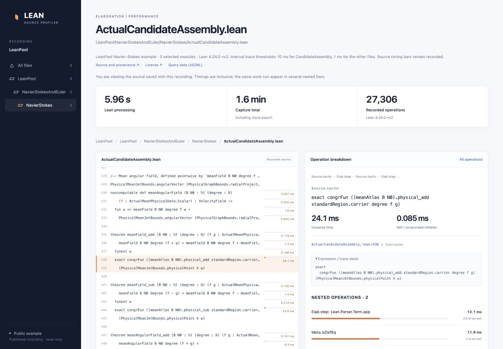
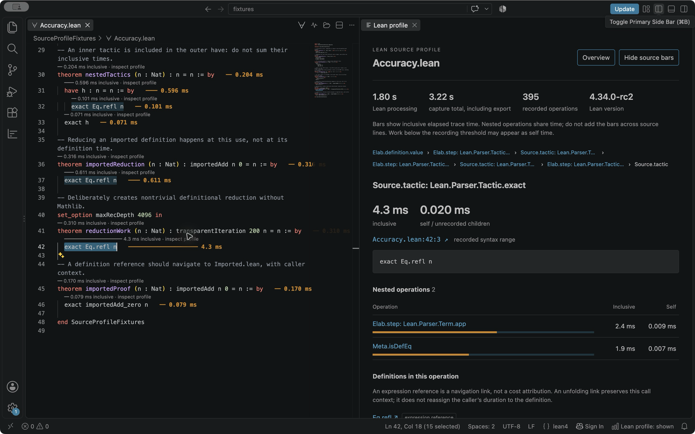
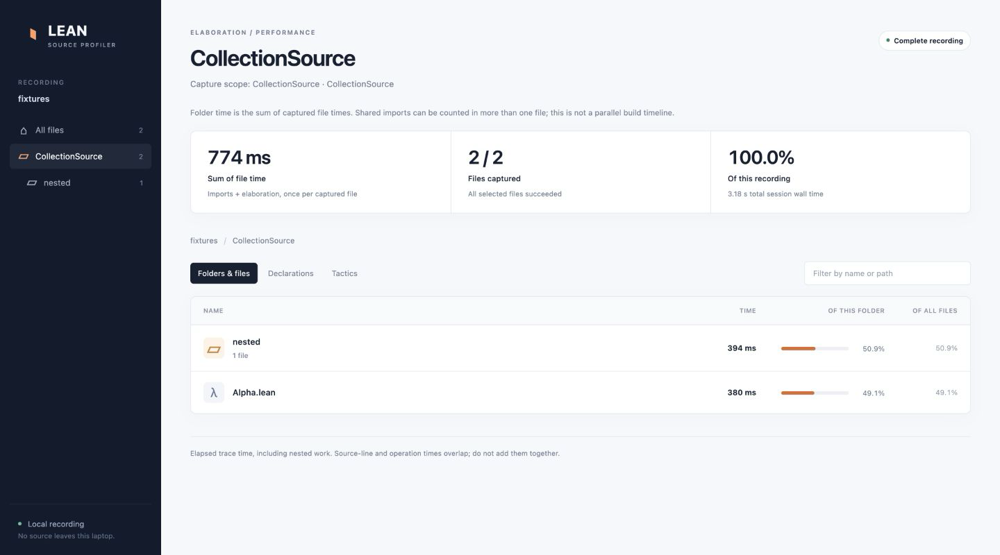
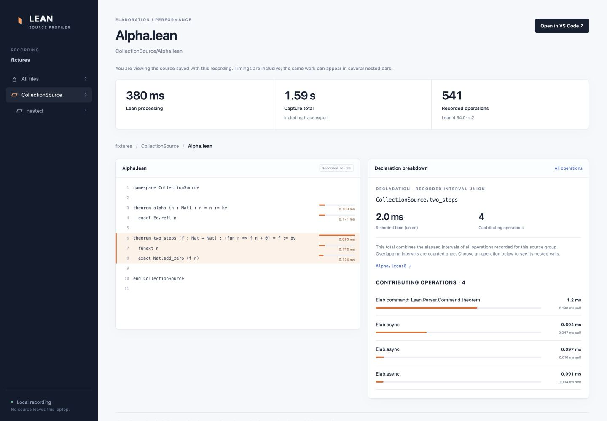

# Lean Source Profiler

Find the Lean code behind an expensive `Meta.isDefEq` or `Meta.whnf` call.

Profile a **file, folder, or project**, then explore the same recording in VS Code or a standalone repository viewer. Query the slowest files, declarations, tactics, and folders from the command line.

Captures now default to **source-focused compact mode**. The driver is compiled once per Lean toolchain and cached; sessions reuse the Lake environment. This mode retains source timings and declaration identities while avoiding full internal tracing and expression rendering. Use `--mode detailed`, or set `leanSourceProfiler.captureMode` to `detailed` in VS Code, when you need internal operations and imported-definition links. [Accuracy, overhead measurements and limitations](docs/LOW-OVERHEAD.md).

**[Download the VS Code extension](https://github.com/Vilin97/lean-source-profiler/releases/latest/download/lean-source-profiler.vsix)** · **[Installation guide](docs/INSTALL.md)** · **[Latest release](https://github.com/Vilin97/lean-source-profiler/releases/latest)**

[**Explore the whole LeanPool profile**](https://vilin97.github.io/lean-source-profiler/pool/)
All **7,060 files** across **214 project groups**, with a flame-like explorer from projects to folders, files, declarations, and individual source lines. The complete capture took **55 hours 34 minutes elapsed**; all files passed their native builds and the final coverage audit. [Dataset, timing definitions, and provenance](docs/WHOLE-POOL.md).

[**Explore Mathlib's Radar benchmarks**](https://vilin97.github.io/lean-source-profiler/mathlib/)
All **8,556 Mathlib files**, with the same flame explorer from folders to files, weighted by CPU instructions or source line count. [Dataset and measurement limits](docs/MATHLIB-RADAR.md). [Measured LeanPool timing repeatability](docs/REPEATABILITY.md).

[**Explore Mathlib's complete source profile**](https://vilin97.github.io/lean-source-profiler/mathlib-source/)
All **8,556 files** in **33 groups**, with descent through folders, files, declarations, and source lines. The capture took **21 hours 56 minutes elapsed** and passed a fresh audit of every recording. [Coverage, provenance, timing definitions, and clock caveat](docs/MATHLIB-SOURCE.md).

[**Compare source profiling with Radar**](https://vilin97.github.io/lean-source-profiler/compare/)
Compare matched file costs from the source profiles, public Mathlib Radar data, and local runs of Radar's measurement code on Mathlib and LeanPool. [Results, repeatability, instrumentation overhead, and measurement limits](docs/PROFILING-COMPARISON.md).

[**Try the interactive LeanPool example →**](https://vilin97.github.io/lean-source-profiler/examples/leanpool/)
Real Navier–Stokes recordings, with source timing bars and nested operations. Opens directly in your browser; no installation needed. [Recording provenance and query data](docs/LEANPOOL-EXAMPLE.md).

[Start at `meanField_add`'s `exact` tactic](https://vilin97.github.io/lean-source-profiler/examples/leanpool/#file=0&event=2356), then follow `physical_add` into its source and its own recording.



## Install in VS Code

1. **[Download `lean-source-profiler.vsix`](https://github.com/Vilin97/lean-source-profiler/releases/latest/download/lean-source-profiler.vsix).**
2. In VS Code, open the Command Palette (`⌘⇧P` on macOS, `Ctrl+Shift+P` on Windows/Linux) and run **Extensions: Install from VSIX…**. Select the downloaded file.
3. Open a saved Lean file and click the **pulse button** in its editor title bar.

No repository clone, npm install, or separate Node.js installation is needed for the VS Code extension. On macOS, you can alternatively download the [installer bundle](https://github.com/Vilin97/lean-source-profiler/releases/latest/download/lean-source-profiler-macos.zip), unzip it, and double-click **Install Lean Source Profiler.command**.

Use your existing Lean/elan installation and build the project's imports first. The native capture path is validated on Linux x64 with Lean 4.34.0-rc2, 4.34.0 and 4.35.0-rc3. Its macOS and Windows paths need platform validation; the earlier interpreted capture was tested on macOS arm64. Viewing saved recordings does not require Lean. See the [installation guide](docs/INSTALL.md) for prerequisites and troubleshooting.

## Explore the source

Click a timing bar above a statement to see its nested operations, inclusive/self time, and the expressions Lean was elaborating or reducing. Definition links let you follow references into other Lean files.



Useful commands in the Command Palette:

| Command, under **Lean Source Profiler** | What it does |
|---|---|
| **Profile Current File** | Captures the file and opens source overlays |
| **Profile Folder** / **Profile Project** | Captures a scope into a session |
| **Open Profile** | Opens a saved file recording or `session.json` |
| **Browse Session Sources** | Chooses another captured file for overlays |
| **Open Standalone Viewer** | Opens the repository viewer in your browser |

You can also right-click a folder in Explorer and choose **Profile Folder**. Captures are saved under the project's `.leanprofiles/` directory. Completed files survive cancellation; failed files remain visible in the session.

## Explore the repository

The standalone viewer starts with the repository structure. Click folders to see their children and their shares of the recorded time. Switch to declaration or tactic rankings, then drill into a source statement and its contributing operations.





Everything runs locally. The viewer uses saved source snapshots and loads individual file traces as needed. A link opens the same recording in VS Code.

## Install the CLI

With **Node.js 20 or newer**, install the prebuilt CLI directly from the release:

```sh
npm install -g https://github.com/Vilin97/lean-source-profiler/releases/latest/download/lean-source-profiler-cli.tgz
```

Then, from a Lean project with built imports, choose a scope:

```sh
lean-profile profile MyFile.lean
lean-profile profile MyFile.lean --mode detailed
lean-profile profile MyLibrary --output /tmp/folder-profile
lean-profile profile --project . --output /tmp/project-profile
```

Choose either viewer for a saved session:

```sh
lean-profile view /tmp/project-profile   # browser; Ctrl-C stops the local viewer
lean-profile open /tmp/project-profile   # VS Code, with this extension installed
```

Use `--list` to inspect which files would be captured. Directory capture skips hidden directories (including `.lake`), dependency/output directories, symlinks encountered during discovery, and `lakefile.lean`. It runs files sequentially using their Lake environment. Output directories must be new.

## Query recordings from an agent or script

```sh
lean-profile query /tmp/project-profile --kind file --limit 1 --json
lean-profile query /tmp/project-profile --kind declaration --limit 10 --json
lean-profile query /tmp/project-profile --kind tactic --path MyLibrary/Analysis --json
lean-profile query /tmp/project-profile --kind folder --limit 10 --jsonl
```

A session contains `session.json`, a compact **`index.jsonl`**, and individual `files/*.leanprofile.json` recordings. JSON query output includes completion status and failed-file counts as well as results. You can also query the index directly:

```sh
jq -s 'map(select(.kind == "file")) | max_by(.durationMs)' /tmp/project-profile/index.jsonl
```

[Read the schema, query options, and timing definitions.](docs/SESSION-FORMAT.md)

## How to read the timings

- **File/folder time** includes import loading and elaboration for each isolated file run. Folder totals sum successful files; shared imports may be loaded repeatedly. Capture wall time, including trace export, is shown separately.
- **Declaration/tactic time** is inclusive recorded elapsed time. Overlapping intervals are counted once within each source group. Nested entries still overlap, so do not sum every bar in a proof. Declaration timings include asynchronous proof work.
- **Self time** subtracts recorded child intervals. Unrecorded work and operations below the trace threshold remain included; this is not CPU sampling.
- **Definition links** distinguish expression references from recorded unfolding evidence. Imported-definition annotations show the selected caller's context, not an independent timer for each definition line.

Source ranges come from structured Lean syntax and declaration metadata. The capture driver runs separately without changing your proofs or installed toolchain. VS Code hides annotations when the source differs from its recording and disables outdated imported locations until imports are rebuilt.

Existing Firefox profiles need recapture because they lack the required source mapping. Detailed trace capture adds overhead; use paired uninstrumented runs for benchmark comparisons. Compact mode trades internal detail for lower overhead, and still has a fixed startup cost. The driver uses Lean internals. More details: [capture internals](lean/README.md), [accuracy and overhead](docs/LOW-OVERHEAD.md).

## Development

```sh
git clone https://github.com/Vilin97/lean-source-profiler.git
cd lean-source-profiler
npm ci
npm run check
npm test
npm run release
```

`npm run release` creates the VSIX, macOS installer ZIP, prebuilt CLI tarball, and checksums in `dist/`. The public release artifacts contain compiled JavaScript; development dependencies are not needed to use them.

The native backend passes **61 unit/CLI/viewer tests**, **13 collection integration checks**, portable capture and stale-import regressions, and compact/exporter, configured-option, kernel and independent-clock checks. The earlier release also passed 17 VS Code integration categories and declaration checks on both NS `meanField_add` variants; those historical results do not validate the new native backend on macOS. See [current validation and measurements](docs/LOW-OVERHEAD.md), the [earlier validation report](docs/PROJECT-PROFILING-RESULTS.md), [test plan](docs/TEST-PLAN.md), and [development fixture instructions](test/fixtures/README.md).

[MIT license](LICENSE) for the profiler. The adapted NS test snippets retain their upstream Apache 2.0 license; see [third-party notices](THIRD_PARTY_NOTICES.md).
